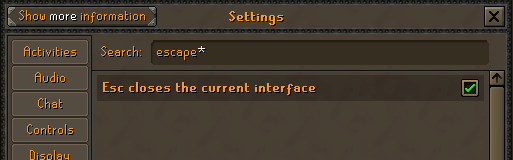
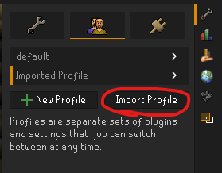
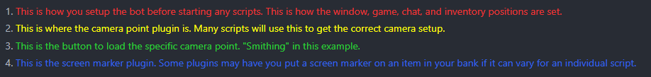
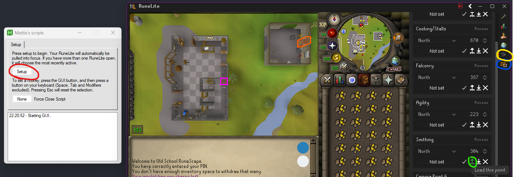
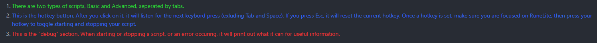
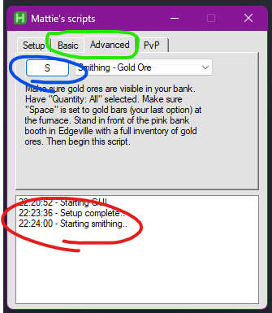

# Mattie's AHK Scripts for OSRS

## Info
These scripts require AHK v2.  
Running through the batch requires you to have git installed.  
Follow the steps below to set up these scripts.

## Downloads
AHK v2 download: https://www.autohotkey.com/v2/  
Git download: https://git-scm.com/downloads

## Clone this repo
1. Open a GIT Bash, Terminal, Powershell, or Command Prompt where you want to save this project (Right-Click Desktop for ease, can move the folder later).  
  
2. Copy and paste this code into your terminal  
```
git clone https://github.com/mattie43/ahk_scripts.git
```  
3. Press Enter. You should now see a folder named ahk_scripts in the same directory.

## Batch file setup
You need to create a PATH in your env variables for "AutoHotKey".

1. Open settings and search for "system variables".  

2. Click "Environment Variables..." button.  

3. Double click "Path" from System variables section.  

4. Select "New" and paste your FOLDER where "AutoHotkey.exe" is located (Make sure it is the v2 .exe). The default path for AHK is "C:\Program Files\AutoHotkey\v2".  

5. You can press "OK" on all open modals to finish.  

6. You can now run `run.bat` inside your ahk_scripts folder to stay up to date and open the program.  


## Runescape setup
Make sure to have these options selected within Runescape's in-game settings.

  
  
  
  
  


These are optional QOL settings you can also add.

  
  


## RuneLite setup
Import the profile that came with this repo (runelite-profile.properties)  
You can rename it if you would like.



This will be the profile you must use with all scripts.  
Runelite will not auto update this import when you pull an update from this repo.  
You will need to re-import each time a new script is added that you want to use.

## Time to run a script
Here are some points to cover about the program:
<!-- 
1. <span style="color: #eb3434">This is how you setup the bot before starting any scripts. This is how the window, game, chat, and inventory positions are set.</span>
2. <span style="color: yellow">This is where the camera point plugin is. Many scripts will use this to get the correct camera setup.</span>
3. <span style="color: #2ad135">This is the button to load the specific camera point. "Smithing" in this example.</span>
4. <span style="color: #3467eb">This is the screen marker plugin. Some plugins may have you put a screen marker on an item in your bank if it can vary for an individual script.</span> -->

<code style="color: aqua">test</code>
- text in red
+ text in green
! text in orange
# text in gray
@@ text in purple (and bold)@@

  


<!-- 1. <span style="color: #2ad135">There are two types of scripts, Basic and Advanced, seperated by tabs.</span>
2. <span style="color: #3467eb">This is the hotkey button. After you click on it, it will listen for the next keybord press (exluding Tab and Space). If you press Esc, it will reset the current hotkey. Once a hotkey is set, make sure you are focused on RuneLite, then press your hotkey to toggle starting and stopping your script.</span>
3. <span style="color: #eb3434">This is the "debug" section. When starting or stopping a script, or an error occuring, it will print out what it can for useful information.</span> -->

  

