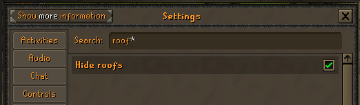

# Mattie's AHK Scripts for OSRS

## Info
These scripts require AHK v2.  
Running through the batch requires you to have git installed.  
Follow the steps below to set up these scripts.

## Downloads
AHK v2 download: https://www.autohotkey.com/v2/  
Git download: https://git-scm.com/downloads

## Clone this repo
1. Open a GIT Bash, Terminal, Powershell, or Command Prompt where you want to save this project (Right-Click Desktop for ease, can move the folder later).  
  
2. Copy and paste this code into your console  
```
git clone https://github.com/mattie43/ahk_scripts.git
```  
3. Press Enter. You should now see a folder named ahk_scripts in the same directory.

## Batch file setup
You need to create a PATH in your env variables for "AutoHotKey".

1. Open settings and search for "system variables".  

2. Click "Environment Variables..." button.  

3. Double click "Path" from System variables section.  

4. Select "New" and paste your FOLDER where "AutoHotkey.exe" is located (Make sure it is the v2 .exe). The default path for AHK is "C:\Program Files\AutoHotkey\v2".  

5. You can press "OK" on all open modals to finish.  

6. You can now run `run.bat` inside your ahk_scripts folder to stay up to date and open the program.  


## Runescape setup
#### Make sure to have these options selected within Runescape's in-game settings.  
  
  
  
  
  
#### These are optional QOL settings you can also add.  
  
  

